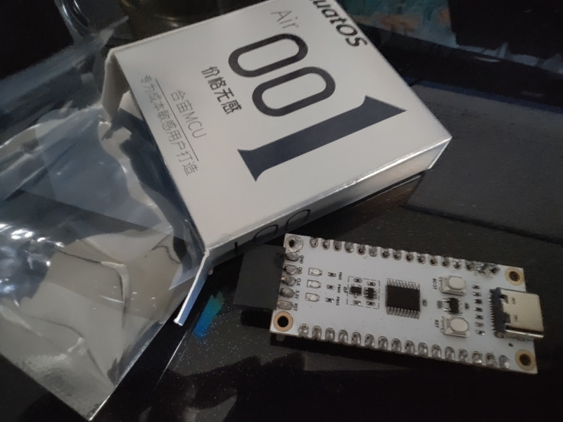

# Airduino

Some libraries, drivers and demos using arduino framework for air001 mcu.

---

Last week, I start to learn embedded development by myself. And luckily, I apply to [luatos](https://wiki.luatos.com/chips/air001/board.html) and get a air001 board from them **without any costs** ^o^!



## Description

### `devs`

The driver of device. Now there is only a few drivers:

- SSD1306 Hardware I2C: OLED/PLED Display
- ST7789 Software SPI: LCD Display
- MPU6050 Hardware I2C: Accelerometer Gyroscope Sensor
   
### `libs`

These libraries are used to make the driver of device **abstract**, for examples:

- Driver
  - `Coordinate` Interface: How to record information
  - `Color` Interface
  - `Display` Interface: How to display
    - `Ssd1306` Driver: Use `Coordinate` & `Color` Interface
    - `St7789` Driver: Use `Color` Interface
    - ...
  - ...
- Function
  - `Graphics`: Drawing: Use `Display` Driver & `Color` Interface
  - `Text`: Writing: Use `Display` Driver & `Color` Interface 
  - ...

They also provide a **uniform** method for using drivers, for example:

```c++
// select display driver
Ssd1306 display_driver(128, 64);
// St7789_7pin display_driver(240, 240, PA_5, PA_7, PA_6, PB_1, PB_0);

// nothing need to change
Graphics<uint8_t> graphics(display_driver);

void loop() {
    graphics.fillScreen(color.white);
    graphics.drawRectangle(7, 7, 119, 27, color.black);
    graphics.drawCircle(63, 47, 16, color.black);
    ...
}
...
```

**Decoupling** driver & function:

```c++
// driver
Ssd1306 display_driver(128, 64);

// function
Graphics<uint8_t> graphics(display_driver);
Text<uint8_t> text(display_driver);

void loop() {
    ...
    text.color(color.black);
    text.at(21, 13).print("Chongwish");
    text.at(39, 39).print("AirMCU!");
    ...
}
...
```

There are some examples to show how they work, such as `./examples/ssd1306.ino`:


As practice, they are all written in modern c++ language.

### `thirds`

Third party dependency.